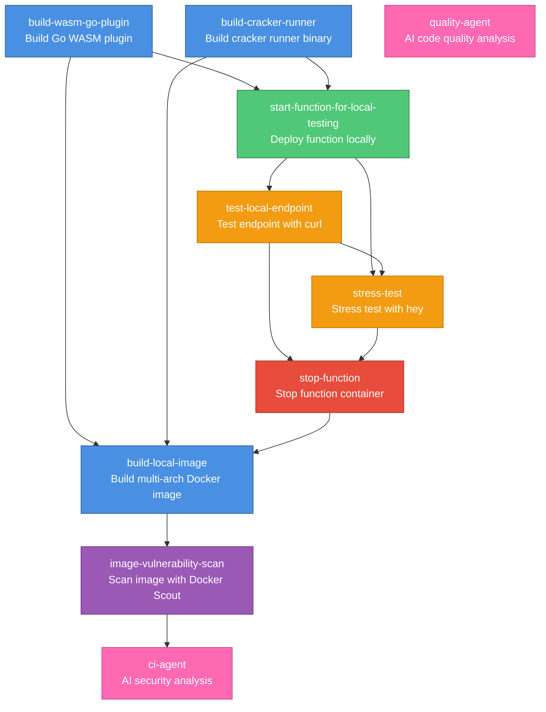

# CI Pipeline DAG

```mermaid
graph TD
    build-wasm-go-plugin[build-wasm-go-plugin<br/>Build Go WASM plugin]:::build
    build-cracker-runner[build-cracker-runner<br/>Build cracker runner binary]:::build
    start-function-for-local-testing[start-function-for-local-testing<br/>Deploy function locally]:::deploy
    test-local-endpoint[test-local-endpoint<br/>Test endpoint with curl]:::test
    stress-test[stress-test<br/>Stress test with hey]:::test
    stop-function[stop-function<br/>Stop function container]:::cleanup
    build-local-image[build-local-image<br/>Build multi-arch Docker image]:::build
    image-vulnerability-scan[image-vulnerability-scan<br/>Scan image with Docker Scout]:::security
    ci-agent[ci-agent<br/>AI security analysis]:::ai
    quality-agent[quality-agent<br/>AI code quality analysis]:::ai

    build-wasm-go-plugin --> start-function-for-local-testing
    build-cracker-runner --> start-function-for-local-testing
    start-function-for-local-testing --> test-local-endpoint
    start-function-for-local-testing --> stress-test
    test-local-endpoint --> stress-test
    test-local-endpoint --> stop-function
    stress-test --> stop-function
    build-wasm-go-plugin --> build-local-image
    build-cracker-runner --> build-local-image
    stop-function --> build-local-image
    build-local-image --> image-vulnerability-scan
    image-vulnerability-scan --> ci-agent

    classDef build fill:#4A90E2,stroke:#2E5C8A,color:#fff
    classDef deploy fill:#50C878,stroke:#2E7D4E,color:#fff
    classDef test fill:#F39C12,stroke:#B8750A,color:#fff
    classDef cleanup fill:#E74C3C,stroke:#A93226,color:#fff
    classDef security fill:#9B59B6,stroke:#6C3483,color:#fff
    classDef ai fill:#FF69B4,stroke:#C1477E,color:#fff
```
